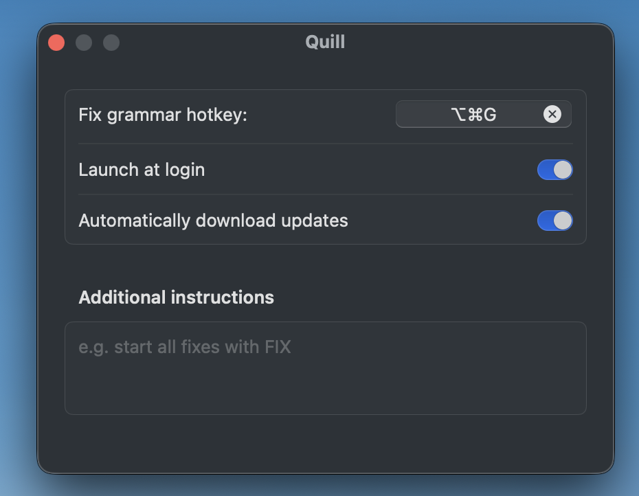
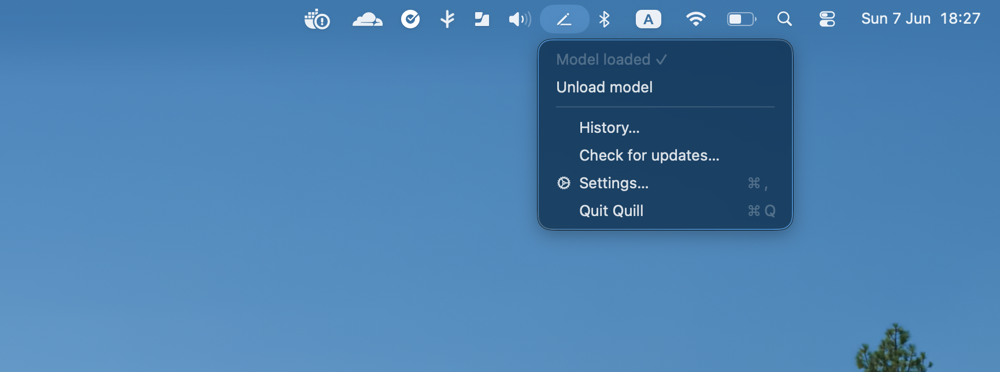

  

<h1 align="center">Quill</h1>

  A minimalist macOS menu-bar grammar &amp; typo fixer powered by a <strong>local</strong> LLM.

Press a global hotkey and Quill fixes the spelling, grammar, and capitalization of the selected
text with a local model — the `UD-Q4_K_XL` GGUF from
[`unsloth/gemma-4-E2B-it-qat-GGUF`](https://huggingface.co/unsloth/gemma-4-E2B-it-qat-GGUF).

  

  <video src="https://github.com/yonigottesman/quill/raw/main/images/recording_fix.mp4" width="640"></video>

## Installation

1. **Download and install the DMG.**

2. **Set the hotkey.** Open the menu-bar icon → **Settings…**. Click the **Fix grammar hotkey**
   recorder and press your key combo (e.g. ⌥⌘G). **This shortcut fixes the selected text.** On first use,
   macOS asks for Accessibility permission. Grant it so Quill can read the selection and paste the fix.

   

3. **Load the model.** Open the menu-bar icon → **Load model**. The first run downloads the GGUF
   weights; later runs load from cache. When it reads **Model loaded ✓**, you're set. Select text in
   any app and press your hotkey.

   

## Development

Building from source, the architecture, and the non-obvious gotchas all live in
[`CLAUDE.md`](CLAUDE.md).
